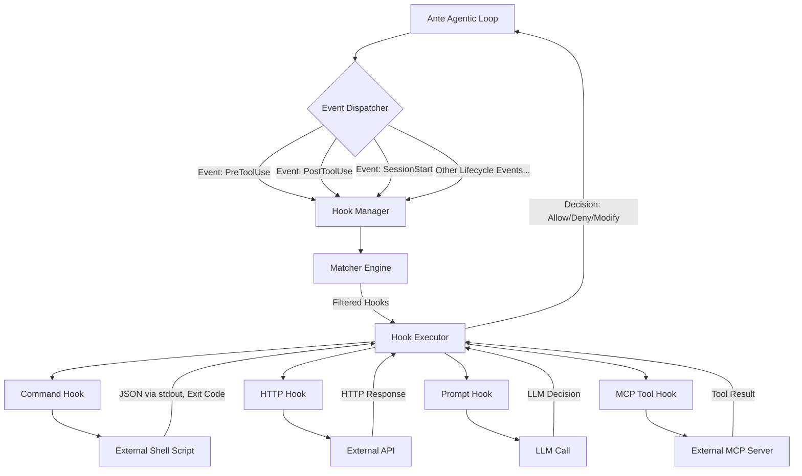

To integrate a hook system similar to Claude Code's into Ante, you would essentially replicate its event-driven, JSON-based mechanism. Since Ante's extension points seem less mature, this would be a significant but structurally straightforward feature addition.

Claude Code's hook system works by allowing users to define custom shell scripts, HTTP endpoints, LLM prompts, or MCP tool calls that are automatically executed at specific points during the AI's operational lifecycle. These hooks receive a JSON payload about the event over `stdin`, and the scripts can allow, block, or modify the AI's behavior by returning specific JSON and exit codes.

### 🧩 How to Integrate a Claude Code-Style Hook System into Ante

The core idea is to embed an event dispatcher within Ante's internal loop (the agentic lifecycle) and create a dedicated hooks manager. This would allow Ante to listen for lifecycle events, run user-defined scripts, and then act on the result. The high-level architecture would look like this:



For a practical integration, the implementation would involve several key components:

1.  **Establish an Event System**: Ante's core loop would need to be instrumented to emit events at critical junctures, such as `BeforeToolUse`, `AfterToolUse`, `OnSessionStart`, and `OnSessionEnd`. This is the foundational step.

2.  **Build a Hook Manager**: A new module within Ante would be responsible for loading hook configurations from JSON files. This manager would listen for the events from the core loop and find the matching hooks to execute.

3.  **Create a Hook Executor**: This component would run the actual hook based on its type:
    *   **Command Hooks**: Execute a local shell script, passing the event data as JSON over `stdin`.
    *   **HTTP Hooks**: Send an HTTP POST request with the JSON payload to a user-configured URL.
    *   **Prompt Hooks**: Send a pre-defined prompt, along with the event context, to an LLM for a decision.
    *   **MCP Tool Hooks**: Invoke a tool from a connected MCP server.

4.  **Enable Hook-Driven Control**: After a hook executes, its output would be parsed. An exit code of `0` would allow the action to proceed. An exit code of `2` (and a "deny" decision) would block it. The hook could also return a modified input for the tool that Ante would then use.

### 🔄 Making Claude Code Hooks Directly Portable

The most practical way to achieve portability is to write an **adapter** for Ante that can natively parse Claude Code's hook configuration files. A user's existing Claude Code hooks, defined in a `.claude/settings.json` file like this:

```json
{
  "hooks": {
    "PreToolUse": [
      {
        "matcher": "Bash",
        "hooks": [
          {
            "type": "command",
            "command": "~/.claude/hooks/block-rm.sh"
          }
        ]
      }
    ]
  }
}
```

Would be directly usable in Ante without modification. The adapter's workflow would be:

1.  A user points Ante to a directory of existing Claude Code hooks, or Ante automatically detects them.
2.  The adapter reads the JSON configuration and translates Claude Code's event names to Ante's analogous lifecycle events (e.g., `PreToolUse` maps to Ante's `BeforeToolUse`).
3.  When Ante reaches that lifecycle event, it hands control to the adapter, which executes the original Claude Code script with the exact JSON payload format it expects.
4.  The adapter translates the script's exit code and JSON output back into a decision for Ante's core loop.

For this to work seamlessly, Ante's internal JSON payloads for events would need to closely match Claude Code's schema (fields like `session_id`, `tool_name`, `tool_input`, `transcript_path`, etc.).

This approach would make the vast ecosystem of Claude Code hooks immediately available to Ante users, dramatically expanding its capabilities and customization options.

If you'd like, we can dive deeper into a specific part of this design, such as the structure of the adapter or the JSON payload schema.
